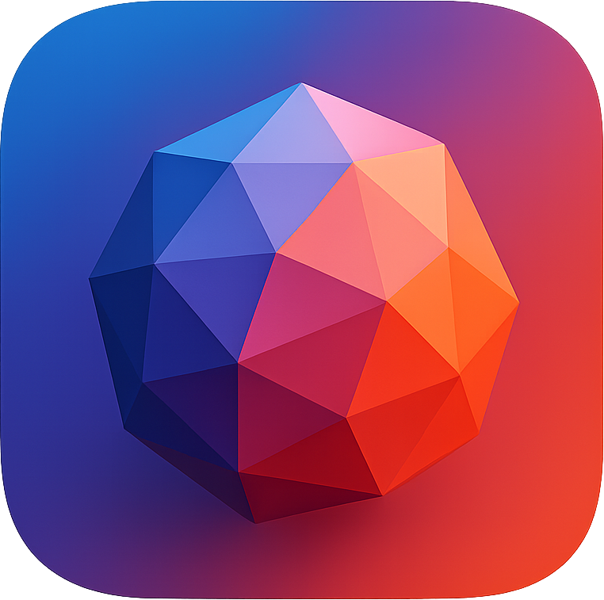

# Nesty Viewer

A high-performance JSON viewer for macOS built with Swift and SwiftUI.

## Features

- **Drag & Drop Interface**: Simply drag and drop JSON files into the application
- **Collapsible Tree View**: Navigate large JSON structures with expandable/collapsible nodes
- **Search Functionality**: Search through JSON keys and values with real-time highlighting
- **Performance Optimized**: Handles large JSON files efficiently with lazy loading
- **Copy Support**: Right-click to copy keys or values to clipboard
- **Syntax Highlighting**: Color-coded JSON elements for better readability

## Requirements

- macOS 14.0 or later
- Xcode 15.0 or later
- Swift 5.9 or later

## Building and Running

1. Open `Nesty Viewer.xcodeproj` in Xcode
2. Select the "Nesty Viewer" scheme
3. Build and run the project (⌘+R)

## Usage

### Opening JSON Files

1. **Drag & Drop**: Drag a JSON file from Finder directly into the application window
2. **Browse Files**: Click the "Browse Files" button to select a JSON file using the file picker

### Navigating JSON Structure

- **Expand/Collapse**: Click the chevron arrows next to objects and arrays
- **Context Menu**: Right-click on any node for additional options:
  - Copy key or value
  - Expand/collapse all children
- **Hover Actions**: Hover over leaf nodes to see a copy button

### Searching

- Use the search bar at the top to search through JSON content
- Search matches both keys and values
- Matching nodes are highlighted in yellow
- The tree automatically expands to show search results

## Performance Features

The application is optimized for handling large JSON files:

- **Lazy Loading**: Tree nodes are rendered on-demand using `LazyVStack`
- **Efficient Search**: Search results are computed efficiently without blocking the UI
- **Memory Management**: Uses `@ObservedObject` and weak references to prevent memory leaks
- **Virtualized Scrolling**: Only visible tree nodes are rendered

## Architecture

The app follows MVVM architecture with SwiftUI:

- **Models**: `JSONNode` - Represents the JSON tree structure
- **Views**: 
  - `ContentView` - Main application view
  - `FileDropView` - Drag & drop interface
  - `JSONTreeView` - Tree visualization
  - `SearchBar` - Search functionality
- **App**: `NestyViewerApp` - Application entry point

## File Types Supported

- `.json` files
- `.txt` files containing JSON data

The application validates that dropped files contain valid JSON before processing.
